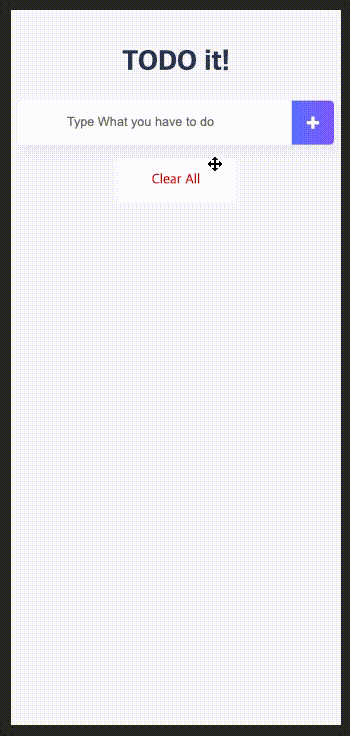

# Do it! Vue.js TODO it!
[**Do it! Vue.js**](http://www.yes24.com/Product/Goods/58206961)에서 나온 TODO it! 프로젝트를 보고 클론 코딩하였습니다.



## Build Setup

``` bash
# install dependencies
npm install

# serve with hot reload at localhost:8080
npm run dev

# build for production with minification
npm run build
```

For detailed explanation on how things work, consult the [docs for vue-loader](http://vuejs.github.io/vue-loader).
